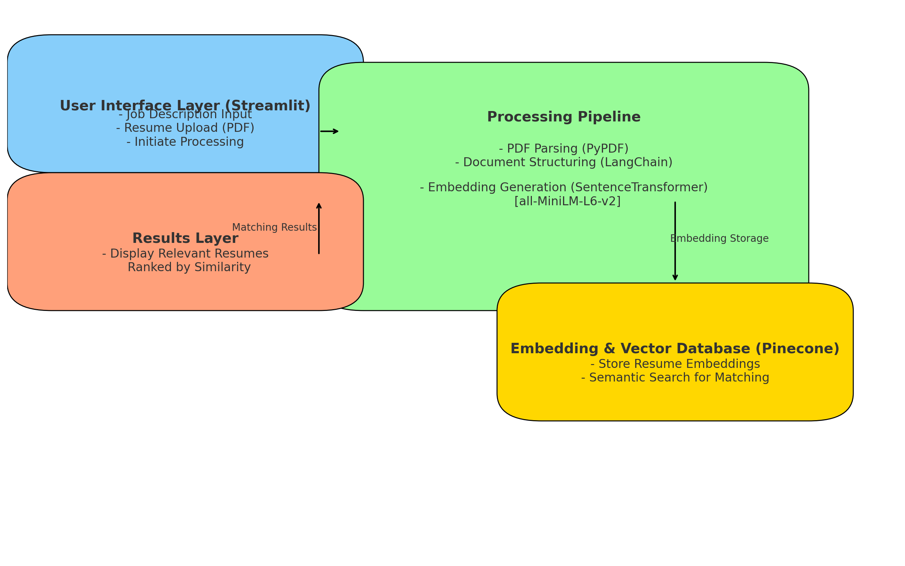
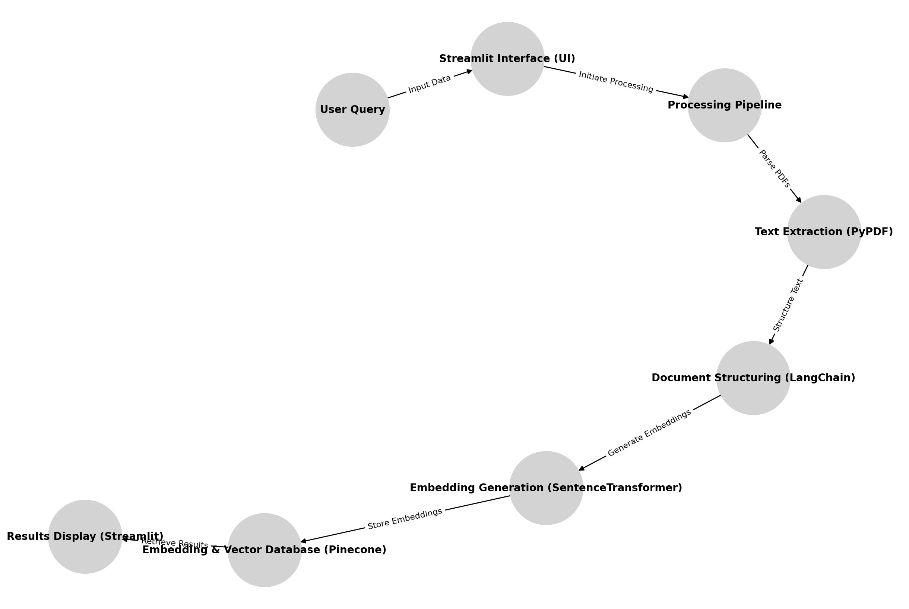

# HR Resume Screening Assistance Tool

## Project Overview

The HR Resume Screening Assistance Tool is a web application designed to streamline the process of resume screening and analysis for HR professionals. By leveraging advanced natural language processing (NLP) techniques, the tool helps recruiters quickly assess and match candidate qualifications with job descriptions. This tool is particularly beneficial for high-volume recruitment, providing an efficient, data-driven approach to filtering candidates.

### Key Features
- **Automated Resume Analysis**: Extracts and analyzes candidate data to find the best match for job descriptions.
- **Scalable Processing**: Supports multiple resumes in PDF format, facilitating quick screening.
- **User-Friendly Interface**: Built with Streamlit, allowing easy navigation without requiring technical knowledge.
- **Integration with Vector Database**: Uses Pinecone for storing and retrieving resume embeddings to improve candidate matching.
- **Custom Embeddings**: Generates semantic embeddings using the `all-MiniLM-L6-v2` SentenceTransformer model.

## Architecture and Design

The project follows a modular architecture where `app.py` serves as the main entry point, providing a Streamlit interface for users, while `utils.py` contains helper functions to process resumes, generate embeddings, and interact with the vector database.

### Architecture Diagram
The architecture includes the following components:
1. **Frontend (Streamlit)**: Provides a web-based UI where users input job descriptions and upload resumes.
2. **Backend Processing (LangChain, SentenceTransformer)**: Utilizes NLP models to generate embeddings from resumes and job descriptions.
3. **Vector Database (Pinecone)**: Stores embeddings and allows similarity-based retrieval, facilitating candidate matching.

#### Diagrams


 <!-- Main architecture overview -->
 <!-- Workflow diagram -->
 <!-- Recently created detailed workflow diagram -->

## Technology Stack

- **Streamlit**: For building a user-friendly web interface.
- **LangChain**: Provides NLP tools and embedding models, facilitating the generation and summarization of resume data.
- **SentenceTransformer (`all-MiniLM-L6-v2`)**: Converts resumes into dense vector embeddings.
- **Pinecone**: A vector database for efficient storage and retrieval of resume embeddings.
- **PyPDF**: Extracts text from uploaded PDF resumes.

## Installation and Setup

### Prerequisites
Ensure Python 3.x is installed on your machine.

### Steps

1. Clone the repository and navigate to the project directory.
   ```bash
   git clone <repository-url>
   cd HR-Resume-Screening-Assistance-Project
   ```

2. Install the required dependencies.
   ```bash
   pip install -r requirements.txt
   ```

3. Configure environment variables:
   - Copy `.env.example` to `.env`.
   - Update Pinecone API details and other necessary configurations in the `.env` file.

4. Run the Streamlit application:
   ```bash
   streamlit run app.py
   ```

## Usage Instructions

1. Open the Streamlit application in a browser.
2. Input the job description in the provided text area.
3. Specify the number of resumes to return in the results.
4. Upload resume PDFs by selecting files.
5. Click "Help me with the analysis" to receive processed results and insights.

## Configuration and Environment Variables

Ensure the following variables are set in your `.env` file:

- **PINECONE_API_KEY**: API key for Pinecone.
- **PINECONE_ENVIRONMENT**: Pinecone environment setting.
- **PINECONE_INDEX_NAME**: Index name for the vector database.

## Testing Guidelines

- Test the application by uploading a sample set of resumes and providing various job descriptions.
- Ensure Pinecone is configured correctly to retrieve the most relevant resumes.

## Further Enhancements

- **Multi-format Support**: Expand support for other resume formats (e.g., Word documents).
- **Advanced NLP Models**: Incorporate more sophisticated NLP models or fine-tune embeddings for better accuracy.

## Contributing

We welcome contributions! If you have suggestions for improvements or new features, please follow these steps:
1. Fork the repository.
2. Create a new branch (`git checkout -b feature/YourFeature`).
3. Make your changes and commit them (`git commit -m 'Add some feature'`).
4. Push to the branch (`git push origin feature/YourFeature`).
5. Open a Pull Request.

## License

This project is licensed under the MIT License. See the [LICENSE](LICENSE) file for details.

## Acknowledgements

- [Streamlit](https://streamlit.io/) for the amazing framework.
- [OpenAI](https://openai.com/) for the NLP models.
- Any other contributors or resources.

## Contact

For questions or inquiries, please reach out to:
- **Prasanth Vemula** - [prasanthvemula1729@gmail.com](mailto:prasanthvemula1729@gmail.com)
- GitHub: [VemulaDowtyasriprasanth](https://github.com/VemulaDowtyasriprasanth)
